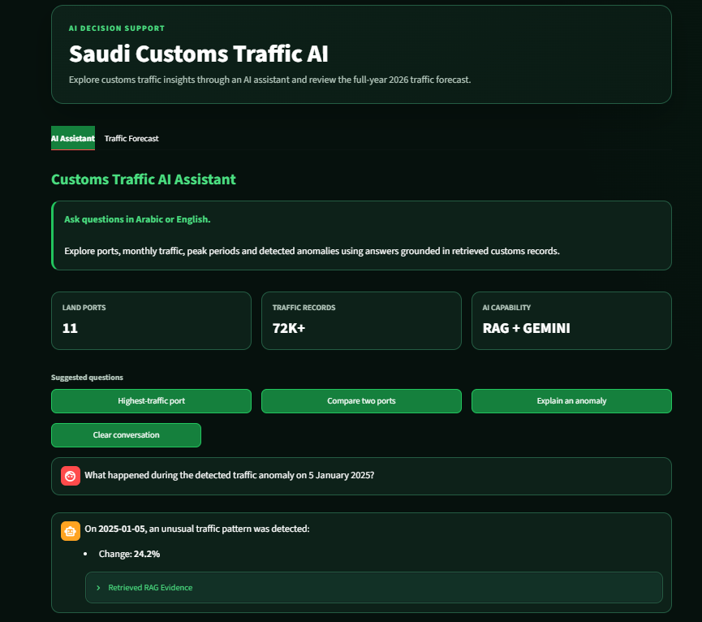
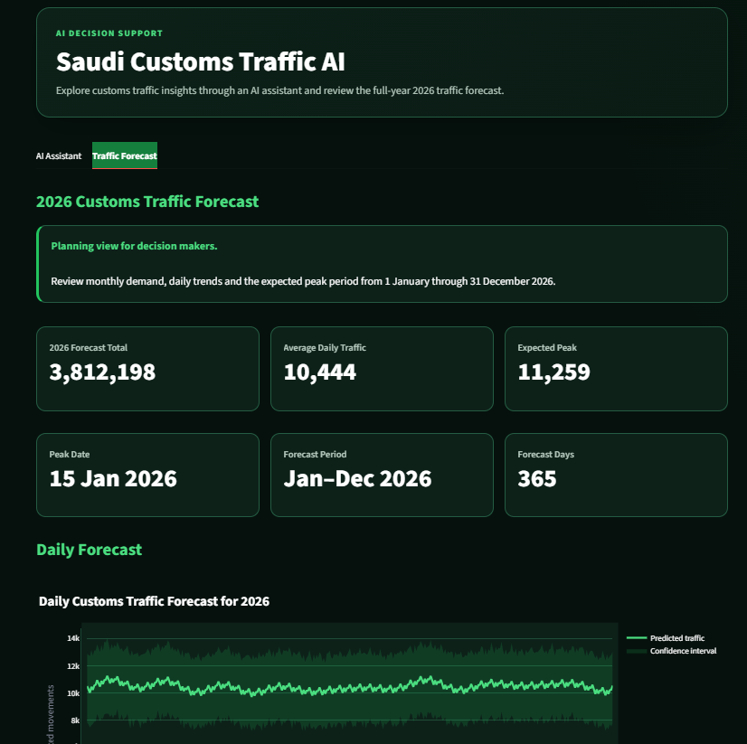

# Saudi Customs Traffic AI Solution

This project analyzes customs traffic across Saudi land ports and provides an AI assistant and a 2026 traffic forecast.

## Main Features

- AI assistant for Arabic and English questions
- Traffic comparison between ports
- Anomaly detection
- 2026 daily and monthly forecasting

## Screenshots

### AI Assistant

### Traffic Forecast

## Technologies

Python, Pandas, Plotly, Prophet, FAISS, LangChain, Gemini, and Streamlit.
